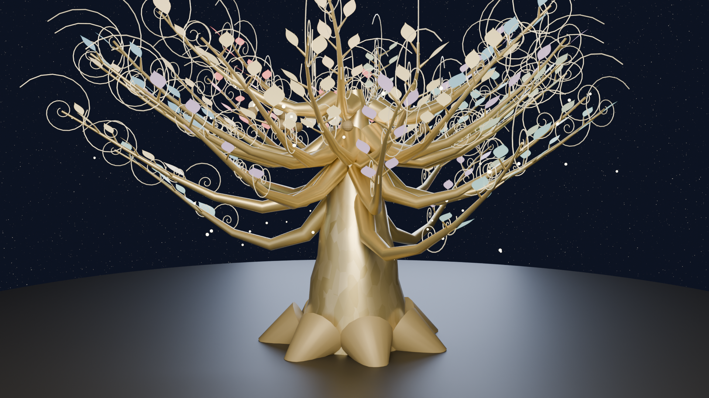

# 世界樹 -YGGDRASIL- 世界の構造樹

**Live: https://sekaiju.pages.dev/**

日本が抱える**250の社会課題**を、一本の世界樹として3Dで可視化するインタラクティブ・アートです。

## 世界樹の読み方

| 部位 | 意味 |
|:---|:---|
| **根**（地下） | 課題の原因。7つの太根（課題群）→35の支根（サブ要素）→250の細根（課題） |
| **幹** | 時間の積層。過去（変えられない）→現在→5〜10年→10〜30年→30年〜の五層 |
| **大枝**（7本） | 7つの課題群。己の根の真上に立つ |
| **中枝**（35本） | サブ要素。先端の色は変化の駆動要素（技術・生産体制・意識・規範）。解決時期が遅いものほど枝先へ |
| **葉**（250枚） | 課題そのもの。はじめは薄い金色、**解決年を迎えるとその課題のテーマ色に染まる** |
| **果実**（2056年〜） | 規範の枝に実る。金の果実＝成果、腐果＝新たな課題（地に落ち、次の世界樹を育てる養分に） |

## 主な機能

- **年表 2026–2080**：▶再生で、葉が枝の根元から先端へ順に色づいていく
- **事業領域設定**：あなたの仕事をキーワード入力 → 端末内AIが240超の課題との関係を5段階でスコアリング。関係する根と枝が黄金に灯る（入力は外部送信されません）
- **35×35 影響ヒートマップ**：全1,225通りの解決シナジーを立体表示
- **解決ログ**：年表が進むと、解決された課題が右のコンソールに流れる
- **自動プレゼン**：カメラが漂い、時代がゆっくり進み、解決された課題の名が明滅する
- **点描モード**：スーラ風の点描で描かれる世界樹
- **BGM**：9曲をランダム連続再生（OFF可）

## 技術

- 依存ライブラリゼロの単一HTML（自前Canvas 3Dエンジン）
- `blender/render_sekaiju.py`：アプリの実データからBlender（Cycles）でキービジュアルを生成するパイプライン

## クレジット

- 企画・構想・監修：鈴木（歴史の総合プロデュース）
- 実装：Claude（Anthropic）との協働
- 理論的背景：『未来世界観 基礎文書 ── 長期合意と文明OS』（五部構成・十四命題）

© 2026 All rights reserved.
